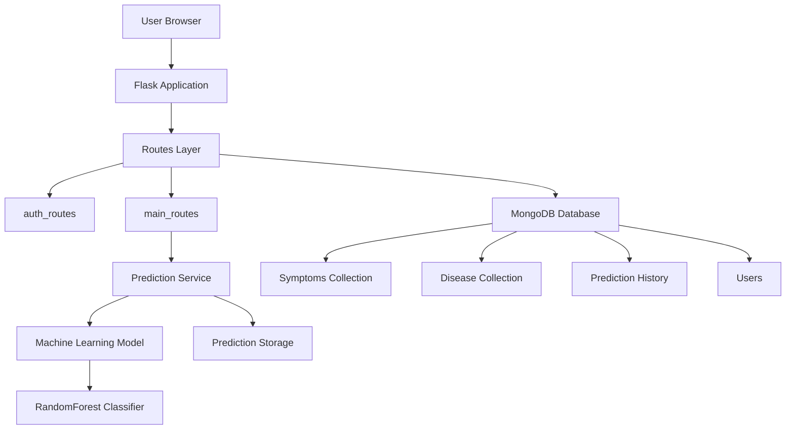
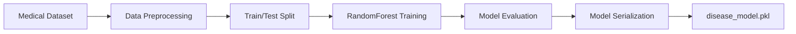

# MediCheck – Machine Learning Disease Prediction System

MediCheck is a **Flask-based machine learning web application** that predicts possible diseases from user-selected symptoms.
The system uses a **Random Forest classifier trained on a medical symptom dataset** and provides the **top probable diseases with prediction probabilities**.

The project demonstrates **full-stack ML integration**, including:

* Web application development using Flask
* Machine learning model training with Scikit-learn
* MongoDB database integration
* Modular backend architecture
* User authentication and prediction history

---

# Project Features

• Disease prediction from symptoms using a trained ML model
• Top disease predictions with probability scores
• User authentication (login/register/logout)
• Prediction history tracking for each user
• MongoDB storage for symptoms, diseases, and prediction history
• Modular Flask backend architecture
• Dynamic symptom fetching via API

---

# Tech Stack

### Backend

* Python
* Flask
* Jinja2

### Machine Learning

* Scikit-learn
* Pandas
* NumPy
* Joblib

### Database

* MongoDB
* PyMongo

### Other Libraries

* python-decouple (environment variables)
* Werkzeug (password hashing)

---

# System Architecture

The system follows a **layered backend architecture** separating routing, services, machine learning logic, and database access.

```
User (Browser)
      │
      ▼
Flask Web Server
      │
      ▼
Routes Layer
(auth_routes, main_routes)
      │
      ▼
Service Layer
(prediction_service)
      │
      ▼
Machine Learning Model
(RandomForest)
      │
      ▼
Database + Storage
(MongoDB + JSON)
```

---

# Detailed Architecture Diagram



---

# Machine Learning Pipeline

The disease prediction model is trained using a **Random Forest classifier** on a dataset of symptoms and corresponding diseases.

### ML Workflow



---

# Prediction Workflow

When a user selects symptoms, the application converts them into a **feature vector** and passes it to the trained model.

```
User selects symptoms
        │
        ▼
Frontend submits form
        │
        ▼
Flask Route receives symptoms
        │
        ▼
Prediction Service
        │
        ▼
Convert symptoms → feature vector
        │
        ▼
RandomForest model inference
        │
        ▼
Top disease predictions generated
        │
        ▼
Results displayed to user
```

---

# Project Structure

```
MediCheck
│
├── main.py
├── config.py
├── database.py
├── requirements.txt
│
├── routes
│   ├── auth_routes.py
│   └── main_routes.py
│
├── services
│   └── prediction_service.py
│
├── model
│   ├── train_model.py
│   ├── disease_model.pkl
│   └── symbipredict_2022.csv
│
├── utils
│   └── file_ops.py
│
├── templates
│
└── static
```

---

# Database Design

MongoDB collections used:

| Collection        | Purpose                  |
| ----------------- | ------------------------ |
| Symptom           | List of medical symptoms |
| Disease           | Disease information      |
| User              | Registered users         |
| PredictionHistory | User prediction records  |

Example symptom document:

```
{
  "symptom": "skin_rash"
}
```

---

# Installation

### 1. Clone the Repository

```
git clone https://github.com/yourusername/medicheck.git
cd medicheck
```

---

### 2. Create Virtual Environment

```
python -m venv venv
```

Activate environment:

**Windows**

```
venv\Scripts\activate
```

**Linux / Mac**

```
source venv/bin/activate
```

---

### 3. Install Dependencies

```
pip install -r requirements.txt
```

---

### 4. Configure Environment Variables

Create a `.env` file:

```
SECRET_KEY=your_secret_key
MONGODB=mongodb://localhost:27017
MEDICHECK_DB_NAME=medicheck_db
```

---

### 5. Train the Model (Optional)

```
python model/train_model.py
```

---

### 6. Run the Application

```
python main.py
```

The application will start at:

```
http://127.0.0.1:5000
```

---

# Future Improvements

• REST API for prediction service
• JWT-based authentication
• Docker containerization
• Deep learning based disease prediction
• Medical report (PDF) analysis
• Integration with X-ray / CT scan models

---

# Resume Description

Developed a **Flask-based machine learning web application** that predicts diseases from symptoms using a **Random Forest classification model trained with Scikit-learn**. Implemented modular backend architecture with **MongoDB integration, REST endpoints, and secure authentication**, along with prediction history tracking for users.

---

# License

MIT License
